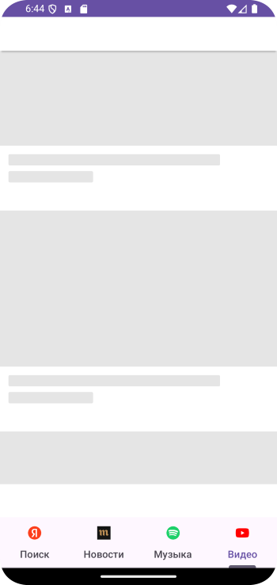

# Домашнее задание по теме "ViewPager2 TabLayout"

## Приложение «Интернет – слайдер»

Необходимо написать приложение с использованием **ViewPager2** и **TabLayout** для перелистывания нужных для Вас страниц интернета. Каждая вкладка именована, например, «Новости», «Музыка», «Кино» и тд. Перелистывая на следующую вкладку загружается та или иная страница. Логика приложения аналогична той, что отрабатывалась на занятии, за исключением того, что в разметке фрагмента будет использоваться элемент **WebView**, для отображения страниц интернета. Адреса страниц и название вкладок **TabLayout** будут храниться в классе модели **Page**, в нем же находится список этих объектов для использования в слайдере. Не забудьте добавить в класс **manifest** разрешение использования интернет – ресурсом и необходимые зависимости в файл сборки для работы с **ViewPager2** и **TabLayout**.

Небольшая подсказка: **WebClient** у **WebView** и загрузка с помощью **loadUrl** будет выполняться во фрагменте(**ViewPagerFragment**), который получает данные(**getSerializable**) в виде объекта **Page** и в **loadUrl** передаем адрес.

Для работы приложения необходимо создать:

1. Фрагмент для слайдера экранов. В файле фрагмента расположен **WebView**.

2. В файле ресурсов **«color»** необходимо создать цвет для атрибута **app:tabIndicatorColor** в элементе **TabLayout** разметки экрана(подчеркивание **Tab**-ов).

Кроме того, для работы с **ViewPager2** необходимо создать класс адаптера, для предоставления фрагментов для слайдера.

Приложение необходимо сохранить проектом в удаленном репозитории, для проверки качества предоставить ссылку преподавателю, либо сделать скрины эмулятора при каждом шаге работы приложения или снять видео экрана при работе приложения.

## Скриншоты к домашнему заданию по теме "ViewPager2 TabLayout"

Скриншоты здесь

